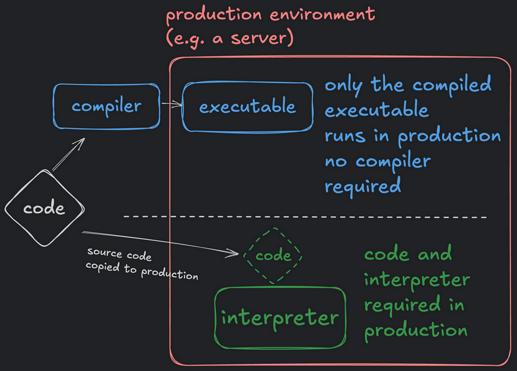
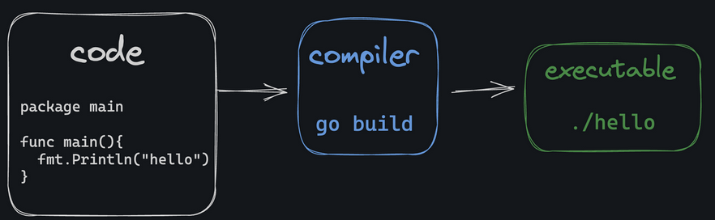
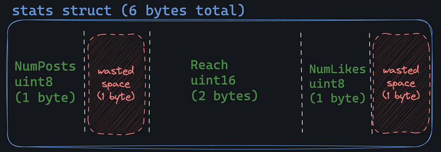
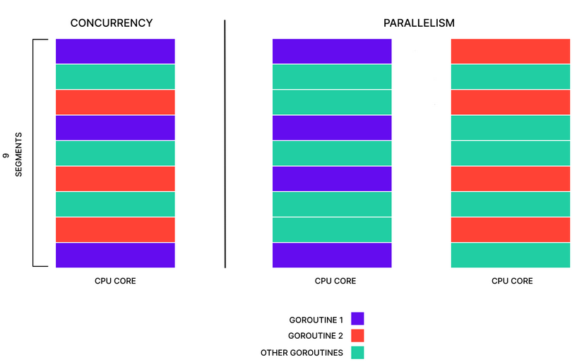

# Introdução
Se trata de uma **linguagem de tipagem forte e estática compilada diretamente pela máquina** para gerar programas que são mais rápídos que de linguagens interpretadas (por exemplo, Python, JS e Ruby)

Quando dizemos que sua tipagem é estática queremos dizer que os tipos das variáveis devem ser "compreendidas" no processo de compilação; isto pode desencadear em erros mesmo sem a execução do código

Um exemplo que ilustra sua forte tipagem é dado abaixo

```go
var myAge uint16 = 25
myAgeInt := int(myAge)
```

Go, apesar de não ser mais rápido que Rust, Zig e C, compila mais rápido que estas

Go possui um **garbage collector (GC)** nativo que tem como função a **liberação de memória** que estava sendo ocupada mas não está mais em uso
# Linguagem interpretada X compilada

Podemos usar um código originário de uma linguagem compilada mesmo sem o ter instalado, uma vez que a compilação consiste em gerar um arquivo executável

O mesmo não pode ser feito para uma linguagem interpretada





# Processo de compilação

**Sempre devemos iniciar nosso código Go definindo um package**

```go
package main

import "fmt"

func main() {
	fmt.Println("The compiled textio server is starting")
}
```

Se trata do processo de gerar um arquivo executável (bin ou exe) a partir do nosso código fonte

Para isso devemos executar o comando `go build` 

Por padrão o nome dado ao executável é o mesmo do arquivo, mas podemos definir um específico se desejado



De forma genérica podemos ter dois tipos de erros em Go:

1. Erro de compilação 
	+ Ocorre durante o processo de compilação
	+ Geralmente são mais fáceis de resolver
	+ **Não é possível fazer deploy em produção com um erro de compilação na linguagem Go**
2. Erro de execução
	+ Ocorre ao longo da execução do código
	+ **São piores que os de compilação pois podem comprometer o funcionamento do programa**

# Compilador - CLI
## go run
Faz a execução de um arquivo .go

`go run <path>.go`
## go mod
Sintaxe: `go mod <option> <nome do modulo>`

`go mod init <nome do modulo>` cria um arquivo go.mod

Análogo ao requirements.txt, isto é, **gerencia nossas dependências**

**Não é recomendado alterar sua estrutura manualmente**

Para atualizar o arquivo go.mod é recomendado fazer uso de comandos como **go get** ou **go mod tidy**
## go get
Realiza a **instação de packages e os adiciona ao arquivo mod.go**

`go get <package>`

## go build
**`go build` realiza a construção do executável** e o seu nome, por padrão é o mesmo do módulo definido usando `go mod init <nome do modulo>`

podemos **alterar seu nome e local** em que será gerado usando a flag **-o**
## go fmt
Sana problemas e discussões a respeito de qual o melhor modo de clear code se comparado a outras linguagens

`go fmt <path>` faz com que **identações** sejam implementadas de modo a deixar o código formatado

`go fmt <path>` **não corrige abertura e fechamento de chaves**
## go vet
Realiza um scan do código e **aponta possíveis erros** que podem ser gerados na compilação que **não são derivados da sintaxe**

**`go vet <path>`**
# Package main

Se trata de um package "especial" na estrutura do código Go

Ele diz ao compilador que este é o código que desejamos que seja transformado num arquivo executável e independente dos demais

Tem como diferencial ao realizarmos o uso de `go build` haja a criação de um **programa executável**, sendo utilizada em situações como essas

Em **packages** denominados de **`main`** somos **"forçados"** a termos uma **função** cujo nome seja também **`main`**

**A função `main` deve ser única dentro do package main, caso contrário temos um conflito de duas funções de mesmo nome no mesmo package sendo declaradas (isso não é exclusivo da main mas deve ser ressaltado)**
# Comentários

Podemos realizar comentários usando
+ // para comentários de uma linha
+ /* \*/ comentários de mais de uma linha 
# Variáveis

**Por padrão são call-by-value**, isto é, quando passamos o valor de uma variável a, por exemplo, uma função, uma cópia do valor da variável é feito e a **função opera sobre ele, sem alterar o valor da variável**
```go
func main() {
    x := 5
    increment(x)

    fmt.Println(x)
    // ainda printa 5, a função increment recebe uma copia do valor de x
}

func increment(x int) {
    x++
}
```

Tem os seguintes tipos primitivos possiveis:
+ `bool` (`true` ou `false`)
+ `string`
+ `rune`
+ `uint`
+ `int`
+ `float`
+ `byte` 8 bits de dados

Podemos declarar variaveis de duas formas possíveis:
```go
var mySkillIssues int
mySkillIssues := 42
```

O primeiro gera a variável com o valor nulo do tipo a ela atribuído, enquanto **o segundo a tipagem é feita pelo compilador do Go**

O segundo método (Walrus) apresenta a restrição de somente poder ser usado dentro do corpo de funções, enquanto o primeiro método pode ser feito em qualquer contexto

**O método Walrus pode acarretar em confusões, uma vez que se já declaramos uma variável anteriormente mas declaramos mais de uma variável em seguida usando Walrus, não há um erro, mas sobrescrita da variável podendo gerar bugs**

```go
func main() {
	mySkillIssues := 10
	mySkillIssues := 42 // retorna erro
	mySkillIssues, mySkill := 42, "study" // não retorna erro
}
```

Podemos definir mais de uma variável na mesma linha, no caso de Walrus ou da forma reduzida, independente da tipagem 

```go
mileage, company := 80276, "Toyota"
var mileage, company = 80276, "Toyota"
```

Quando utilizado a forma completa, os tipos das variáveis devem ser os mesmos

```go
var mileage, company string = "80276", "Toyota"
```

Para descobrirmos o tipo de uma variável é necessário usar formatação de strings e printar no console usando `%T`

```go
fmt.Printf("mileage = %T", mileage) // string
```

## Integers, Floats e Complexos

Go nos oferece precisão de bits de variáveis numéricas

+ int8
+ int16
+ int32
+ int64
+ uint8
+ uint16
+ uint32
+ uint64
+ uintptr (pointer)
+ float32
+ float64
+ complex64 (composto de parte real e imaginária de int32)
+ complex128 (composto de parte real e imaginária de int64)

**No entanto, não precisamos especificar se o intuito não for ganho de performance (por exemplo, uso de menos memória)**

Podemos usar as tipagens da seguinte forma

+ int
+ uint
+ float64
+ complex128

Podemos converter um tipo de variável numérica a outra chamando as tipagens acima como função

```go
temperatureFloat := 88.26
temperatureInt := int64(temperatureFloat)
```

**Nesse caso acima, a parte fracionária é truncada**

# Constantes

Podemos declarar constantes usando o keyword `const` e elas **devem ter seus valores conhecidos durante a compilação**

```go
// não funciona pois seu valor somente será descoberto na execução
const currentTime = time.Now()
```

Se a computação de seu valor ocorrer durante a compilação, não há erros

```go
const firstName = "Lane"
const lastName = "Wagner"
const fullName = firstName + " " + lastName
```

**Somente podem ser dos tipos de variáveis primitivos (bool, int, float64, uint, string, complex, byte, rune)**

Podemos ter dois tipos de constantes, um mais flexível e outro mais rígido

```go
const pi = 3.14159 // pode adotar qualquer tipo numérico numa operação
const pi float64 = 3.14159 // somente pode operar como float
```

Quando desejamos definir variáveis que são incrementais em relação umas as outras podemos fazer uso de `iota`, um tipo especial que dentro do bloco de definição de constantes se auto-incrementa

Podemos usá-la até mesmo em expressões na definição de funções

```go
const (
    Sunday = iota    // 0
    Monday          // 1
    Tuesday         // 2
    Wednesday       // 3
    Thursday        // 4
    Friday         // 5
    Saturday        // 6
)
```
```go
const (
    // Bit shifting
    KB = 1 << (10 * iota)  // 1 << (10 * 0) = 1
    MB                     // 1 << (10 * 1) = 1024
    GB                     // 1 << (10 * 2) = 1048576
    TB                     // 1 << (10 * 3) = 1073741824
)

const (
    // Skip values
    _           = iota             // 0
    Debug Level = 1 << iota       // 1 << 1
    Info                          // 1 << 2
    Warning                       // 1 << 3
    Error                        // 1 << 4
)

const (
    // Offset and multiplier
    Offset = 2 * iota + 1  // 1
    _                      // 3
    Value                  // 5
    _                      // 7
    Result                 // 9
)
```
# Condicionais

São usados para tomada de decisão com base em condições

Pode adotar duas formas
+ Forma mais simples e concisa

```go
if height > 6 {
    fmt.Println("You are super tall!")
} else if height > 4 {
    fmt.Println("You are tall enough!")
} else {
    fmt.Println("You are not tall enough!")
}
```

+ Definição de variável efêmera e somente acessível no bloco condicional
```go
if height := 0; height > 6 {
    fmt.Println("You are super tall!")
} else if height > 4 {
    fmt.Println("You are tall enough!")
} else {
    fmt.Println("You are not tall enough!")
}
```

Assim como em Python que tem o `match` em Go podemos usar o `switch
```go
func getCreator(os string) string {
    var creator string
    
    switch os {
	    case "linux":
	        creator = "Linus Torvalds"
	    case "windows":
	        creator = "Bill Gates"
	    case "mac":
	        creator = "A Steve"
	    default:
	        creator = "Unknown"
    }
    return creator
}
```

E assim como nos blocos if, else if e else, podemos introduzir uma variável efêmera e que é somente acessível no bloco switch
```go
func main( string {
    
    switch os := "linux"; os {
	    case "linux":
	        creator := "Linus Torvalds"
	    case "windows":
	        creator := "Bill Gates"
	    case "mac":
	        creator := "A Steve"
	    default:
	        creator := "Unknown"
    }
    return creator
}
```

O bloco ainda pode usar o keyword `fallthrough`, que faz com que, caso uma condição se satisfaça, o próximo `case` seja executado, **não é recomendado seu uso apesar de existir** pois pode causar confusão em debugs
```go
func getCreator(os string) string {
    var creator string
    
    switch os {
	    case "linux":
	        creator = "Linus Torvalds"
	    case "windows":
	        creator = "Bill Gates"
	
	    // todos esses três retornarão "A Steve" se a variável os satisfazer
	    // qualquer uma das condições
	    case "macOS":
	        fallthrough
	    case "Mac OS X":
	        fallthrough
	    case "mac":
	        creator = "A Steve"
	
	    default:
	        creator = "Unknown"
    }
    return creator
}
```
# Loops
# Strings

**São consideradas pelo compilador como uma sequência de bytes**

**Strings em Go são definidas, obrigatoriamente, por aspas duplas ou backticks \`\`**

Strings de aspas duplas são as literais enquanto as strings com backticks são as raw strings

Podemos concatenar strings usando `+` 

## Formatação

```go
%v // usa o valor da variável 
%s // usa o valor da variável de forma mais específica
```


# Integers

## Formatação

```go
%v // usa o valor da variável  
%d // usa o valor da variável de forma mais específica
```

# Floats
**Por floats não serem exatos não é recomendado comparações entre floats usando == e !=** dado que uma minima imprecisão pode levar a um resultado booleano inesperado. Dessa forma, recomenda-se definir um **epsilon** (valor máximo permitido de variancia) em que é aceitavel sua imprecisão e **checar se o float se enquadra em tal intervalo**

**Floats não podem realizar a operação de modulo %**

Se um float diferente de 0 é dividido por 0 seu resultado é **+Inf** ou **-Inf**

Se **0.0 é dividido por 0.0** é retornado **NaN**
## Formatação

```go
%v // usa o valor da variável  
%f // usa o valor da variável de forma mais específica
%.2f // formata o valor para o número de casas decimais especificada
```

# Boolean

## Formatação

```go
%v // usa o valor da variável  
%t // usa o valor da variável de forma mais específica
```

# Bytes
Um tipo especial equivalente ao uint8
# Runes

Se trata basicamente de um "apelido" para o tipo `int32`

**Assim, podemos observar que uma rune é basicamente um integer de 32 bits que permite comportar Unicode code points**

Devemos usar runes quando:
+ Queremos manipular strings
+ Queremos atuar em cima de caracteres individuais dentro de uma string
+ Queremos incluir emojis, caracteres asiáticos, dentre outros caracteres especiais nas nossas strings

```go
package main

func main() {
	const name = "boots"
	fmt.Printf("constant 'name' byte length: %d\n", len(name))
	fmt.Printf("constant 'name' rune length: %d\n", utf8.RuneCountInString(name))
	fmt.Println("=====================================")
	fmt.Printf("Hi %s, so good to have you back in the arcanum\n", name)
}
/*
constant 'name' byte length: 5 
constant 'name' rune length: 5 
Hi boots, so good to have you back in the arcanum
*/
```

```go
package main

func main() {
	const name = "🐻"
	fmt.Printf("constant 'name' byte length: %d\n", len(name))
	fmt.Printf("constant 'name' rune length: %d\n", utf8.RuneCountInString(name))
	fmt.Println("=====================================")
	fmt.Printf("Hi %s, so good to have you back in the arcanum\n", name)
}

/* 
constant 'name' byte length: 4 
constant 'name' rune length: 1 
Hi 🐻, so good to have you back in the arcanum
*/
```

Para lidarmos com caracteres especiais devemos fazer uso da biblioteca strconv (descrita posteriormente em mais detalhes)
## Formatação
```go
%v // usa o valor da variável  
%c // usa o valor da variável de forma mais específica
```
# Funções

A sintaxe adotada pela definição de funções em Go é marcada por:
+ Tipagem dos parâmetros
+ Tipagem dos valores de retorno

A primeira linha da definição de função é denominada de "assinatura da função" (function signature)

```go
package main

func sub(x int, y int) int {
    return x-y
}
```

Em casos onde temos mais de um parâmetro de mesmo tipo podemos adotar a seguinte sintaxe

```go
package main

func sub(x, y int) int {
    return x-y
}
```

Se após esses dois parâmetros ainda desejamos incorporar outros tipos, podemos
```go
package main

func sub(x, y int, z string) int {
	z = int(z)
    return x-y+z
}
```

## Funções como tipos

**Podemos atribuir a uma variável seu tipo como uma função**

No caso abaixo f é uma variável que:
+ Armazena uma função que aceita como input uma outra função e um int
+ A função presente nos parâmetros aceita dois int e retorna um int
+ **O resultado da variável f depende do int retornado pela função do primeiro parãmetro e do int dado como argumento**
```go
var f func(func(int,int) int, int) int
```

Podemos ignorar um valor retornado por uma função ao atribuir seu valor a _
```go
package main

func getPoint() (x, y int) {
    return 3, 4
}

// ignora y
x, _ := getPoint()
```

## Retornando valores
Podemos atribuir nomes às variáveis que serão retornadas e, desse modo, podemos chamar um return vazio (**naked return**) que ele entenderá quais as variáveis devem ser retornadas e suas respectivas ordens

**Naked returns devem ser utilizados somente em funções pequenas, pois, podem dificultar eventuais debugs**

Os dois códigos abaixo são equivalentes

```go
package main

func getCoords() (int, int) {
	var x int
	var y int
	return x, y // 0, 0
}
```

```go
package main

func getCoords() (x, y int) {
	// codigo da função

	return //naked return
}
```

**Quando nomeados nossas variáveis de outputs** não precisamos defini-lás usando := ou a notação completa, as variáveis **são consideradas já existentes no corpo da função**

```go
package main

func yearsUntilEvents(age int) (yearsUntilAdult, yearsUntilDrinking, yearsUntilCarRental int) {
	yearsUntilAdult = 18 - age // sem Walrus
	if yearsUntilAdult < 0 {
		yearsUntilAdult = 0
	}
	yearsUntilDrinking = 21 - age // sem Walrus
	if yearsUntilDrinking < 0 {
		yearsUntilDrinking = 0
	}
	yearsUntilCarRental = 25 - age // sem Walrus
	if yearsUntilCarRental < 0 {
		yearsUntilCarRental = 0
	}
	return // naked return
}
```

**O uso de variáveis de retorno nomeadas é recomendado uma vez que facilita a compreensão da função e ajuda em debugs**

```go
package main

func calculator(a, b int) (mul, div int, err error) {
    if b == 0 {
      return 0, 0, errors.New("can't divide by zero")
    }
    mul = a * b
    div = a / b
    return mul, div, nil
}
```

Se for retornado explicitamente os valores, eles sobrescrevem as variáveis de retorno

```go
package main

func getCoords() (x, y int) {
    return 5, 6 // x e y NÃO são retornados
}
```

Assim como em Python, podemos retornar valores mais de uma vez ao longo do corpo da função (**early returns**). Isso permite que, em dadas condições, podemos retornar um valor específico (**guard clauses**)

```go
package main

func divide(dividend, divisor int) (quotient int, error) {
	if divisor == 0 {
		return 0, errors.New("can't divide by zero")
	}
	return dividend / divisor, nil
}
```

Assim como em Python, **funções são tipos como int, float, bool e todos os outros** podendo ser usada como parâmetros de funções e retorno de funções

```go
package main

func add(x, y int) int {
	return x + y
}

func mul(x, y int) int {
	return x * y
}

func aggregate(a, b, c int, arithmetic func(int, int) int) int {
  firstResult := arithmetic(a, b)
  secondResult := arithmetic(firstResult, c)
  return secondResult
}

func main() {
	sum := aggregate(2, 3, 4, add)
	// soma = 9
	product := aggregate(2, 3, 4, mul)
	// produto = 24
}
```

## Funções anônimas
Assim como as lambdas de Python, podemos definir funções anônimas em Go

```go
package main

func double(a int) int {
    return a + a
}

func conversions(f func(int) int, a, b, c int) (int, int, int) {
	temp1 := f(a)
	temp2 := f(b)
	temp3 := f(c)
	
	return temp1, temp2, temp3
}

func main() {
    // usando uma função nomeada
	newX, newY, newZ := conversions(double, 1, 2, 3)
	// newX = 2, newY = 4, newZ = 6

    // usando função anônima
	newX, newY, newZ = conversions(func(int) int {
	    return a + a
	}, 1, 2, 3)
	// newX = 2, newY = 4, newZ = 6
	
	// fazendo de forma separada para facilitar a compreensão
	doubleAnonymous := func(a int) int {
		return a + a
	}
	newX, newY, newZ = conversions(doubleAnonymous, 1, 2, 3)
	// newX = 2, newY = 4, newZ = 6
}
```

## Deferred functions
Go possui o keyword `defer` que **defere o statement para que seja executado logo antes do return da função**. Deferred functions são usadas para **realizar limpeza de recursos,** como por exemplo, conexões com bases de dados e fechamento de arquivos

**O `defer` é avaliado imediatamente, mas executado somente prestes ao retornar o valor da função**

**É uma excelente maneira de garantir que algo aconteça antes da função finalizar sua execução**

```go
package main

import "db"

func GetUsername(dstName, srcName string) (username string, err error) {
	// Open a connection to a database
	conn, _ := db.Open(srcName)

	// Close the connection *anywhere* the GetUsername function returns
	defer conn.Close()

	username, err = db.FetchUser()
	if err != nil {
		// The defer statement is auto-executed if we return here
		return "", err
	}

	// The defer statement is auto-executed if we return here
	return username, nil
}
```

## Escopos de funções
Ao contrário de Python que tem como escopo funções (function-scoped), **Go tem como escopo cada bloco (block-scoped)**

Um bloco em Go é definido por abertura e fechamento de chaves { bloco }

**Variáveis de um escopo mais interno podem acessar as mais externas, mas não o contrário**

```go
package main

func main() {
	a := "olá"
    { 
	    // isto é um bloco explícito 
        age := 19
        // está ok pois acessa uma mais externa e uma interna
        fmt.Println(age, a)
    }

    // não está ok pois a variável esta fora de seu escopo
    fmt.Println(age)
}
```
## Closures

Se tratam de funções que referenciam variáveis que se situam externas ao seu escopo, podendo realizar alterações sobre elas.** Cada execução de uma Closure acarreta numa modificação dessa variável**
```go
package main

func concatter() func(string) string {
	doc := ""
	return func(word string) string {
		doc += word + " "
		return doc
	}
}
```

No caso acima, a cada invocação de concatter() uma função é retornada. A cada chamada dessa função retornada temos alterações no doc, isso faz com que seu output seja alterado a cada chamada 

**A função retornada tem uma referência à variável definida no corpo de concatter, assim, por estar num bloco mais interno e ter acesso a ela, a cada chamada dessa função retornada é realizado alterações na referência dessa variável**
```go
func main() {
	harryPotterAggregator := concatter()
	harryPotterAggregator("Mr.")
	harryPotterAggregator("and")
	harryPotterAggregator("Mrs.")
	harryPotterAggregator("Dursley")
	harryPotterAggregator("of")
	harryPotterAggregator("number")
	harryPotterAggregator("four,")
	harryPotterAggregator("Privet")

	fmt.Println(harryPotterAggregator("Drive"))
	// Mr. and Mrs. Dursley of number four, Privet Drive
}
```
## Currying

É conceito de aplicação parcial de funções

**Se trata de funções que aceitam uma segunda função como argumento e seu valor de retorno é uma terceira função (anônima) que quando invocada, chama a função passada como argumento**

```go
package main

func multiply(x, y int) int {
  return x * y
}

func add(x, y int) int {
  return x + y
}

func selfMath(mathFunc func(int, int) int) func (int) int {
  return func(x int) int {
    return mathFunc(x, x)
  }
}

func main() {
  squareFunc := selfMath(multiply)
  doubleFunc := selfMath(add)

  fmt.Println(squareFunc(5))
  // prints 25

  fmt.Println(doubleFunc(5))
  // prints 10
}
```
# Structs

**Usamos Structs em Go para realizar a representação de dados de forma estruturada**

Podemos fazer um paralelo de Structs e Classes em Python apesar de Go não ser OOP
## Structs nomeados
Por se tratar de um novo tipo, Structs nomeados devem ser definidos usando o keywork `type`
```go
type car struct {
	brand      string
	model      string
	doors      int
	mileage    int
}
```

Podemos notar que cada componente do Struct tem uma tipagem específica e que, se não atribuído nenhum valor em sua instanciação ele é o valor zero daquele dado tipo
```go
myCar := car{}
// brand = ""
// model = ""
// doors = 0
// mileage = 0
```

Podemos realizar o aninhamento de Structs, desse modo podemos ter um campo em um Struct que é do tipo de um outro Struct, incorporando sua estrutura dentro de um campo
```go
type car struct {
  brand string
  model string
  doors int
  mileage int
  frontWheel wheel
  backWheel wheel
}

type wheel struct {
  radius int
  material string
}
```

Podemos então instanciar um novo tipo e atribuir valores da seguinte forma
```go
myCar := car{}
myCar.frontWheel.radius = 5 // dot notation
```

## Structs anônimos

São como Structs comuns porém sem uma definição explicíta usando `type`
```go
myCar := struct {
  brand string
  model string
} {
  brand: "Toyota",
  model: "Camry",
}
```

**Seu uso é recomendado em situações onde o Struct será usado pontualmente, sem reuso**

Podemos definir Structs anônimos dentro de um outro Struct, apesar de isso poder dificultar eventuais debugs
```go
type car struct {
  brand string
  model string
  doors int
  mileage int
  
  wheel struct {
    radius int
    material string
  }
}

var myCar = car{
  brand:   "Rezvani",
  model:   "Vengeance",
  doors:   4,
  mileage: 35000,
  wheel: struct {
    radius   int
    material string
  }{
    radius:   35,
    material: "alloy",
  },
}
```

O uso de Structs anônimos pode ser feito, por exemplo, quando queremos lidar com algum formato JSON específico que não será necessário reutilizar sua estrutura em nenhuma parte do código
## Structs embarcados (Embedded Structs)
Se tratam de Structs que tem dentro de sua composição um Struct sem definição do seu tipo possibilitando o acesso de seus fields

```go
type vehicle struct {
  brand string
  model string
}

type truck struct {
  car
  bedSize int
}
```

Para acessar os campos do Struct embarcado a notação muda um pouco se comparada a casos onde um field do novo Struct tem como tipo outro Struct. Tomando como exemplo o Struct `car` definido na seção acima e o `truck` dessa seção podemos comparar como seriam acessados os field

```go
package main

import "fmt"

v := truck{
	car: car{
		brand: "Toyota"
		model: "Corolla"
	},
	bedSize: 10
}

var myCar = car{
  brand:   "Rezvani",
  model:   "Vengeance",
  doors:   4,
  mileage: 35000,
  wheel: struct {
    radius   int
    material string
  }{
    radius:   35,
    material: "alloy",
  },
}	

fmt.Println(v.brand) // printa "Toyota", field em top level
fmt.Println(myCar.wheel.radius) // printa 35, field aninhado
```

## Structs vazios
**São os menores types possiveis em termos de memoria em Go**

Podemos fazer uso de Structs vazios para operações unárias

Para fazermos um Struct vazio e anônimo é usado a seguinte sintaxe

```go
empty := struct{}{}
// struct{} é o tipo e {} é o seu valor
```

Enquanto para um Struct nomeado vazio
```go
type emptyStruct struct{}
empty := emptyStruct{}
```
## Métodos de Structs
Apesar de não ser OOP, Go aceita definirmos métodos (receiver functions) a Structs

Como veremos mais a frente isso está fortemente à flexibilidade do Go com o uso de Interfaces

Podemos definir métodos seguindo a notação:

```go
type rect struct {
  width int
  height int
}

// (r rect) declara o receiver; o Struct que irá ser capaz de usar tal método
func (r rect) area() int {
  return r.width * r.height
}

var r = rect{
  width: 5,
  height: 10,
}

fmt.Println(r.area()) // uso do método
```
## Armazenamento de Structs in-memory
Seu armazenamento consiste em um **bloco contíguo com os fields ordenados como na definição do Struct** isso otimiza o acesso aos fields uma vez que estão "juntos" em um único bloco e não dispersos, como por exemplo elementos de uma lista de Python

```go
type stats struct {
	Reach    uint16
	NumPosts uint8
	NumLikes uint8
}
```


**No entanto, a ordem com que são definidos os Fields importa** quando tratamos de otimização de memória

```go
type stats struct {
	NumPosts uint8
	Reach    uint16
	NumLikes uint8
}
```



**O modo recomendado de definição de Fields em Structs consiste em ordenar as tipagens da maior para a menor**

Para analisarmos melhorias que podem serem feitas podemos usar o package reflect para debug

```go
typ := reflect.TypeOf(stats{})
fmt.Printf("Struct is %d bytes\n", typ.Size())
```

bool = 1 byte
uint16 = 2 bytes
int64 = 8 bytes
## Tags
**Tags são modos de definirmos metadados dos Fields dos Stucts**

Podemos fazer uso de tags na definição de um Struct para instruir como ele deve se comportar mediante a encoding de JSON, XML, packages de ORM, dentre outros

```go
type User struct {
    Name  string `json:"name"` // Name deve aparecer como name em JSON
    Age   int    `json:"age"` // Age deve aparecer como age em JSON
    Email string `json:"email"` // Email deve aparecer como email em JSON
}
```

Algumas Tags tem notação específica e definem comportamentos que podem ser desejados em determinadas situações

```go
type User struct {
    Name     string `json:"name"`
    Age      int    `json:"age,omitempty"` // se vazio ou valor nulo é excluido do JSON
    Password string `json:"-"` // Exclui do JSON
}
```

Podemos contornar o comportamento de omitempy para campos com valores nulos mas não vazios usando pointers

```go
type User struct {
    Name     string `json:"name"`
    Age      int    `json:"age,omitempty"` // se vazio é excluido do JSON
    Password string `json:"-"` // Exclui do JSON
}
```

Podemos capturar estruturas inesperadas ao atribuir um map cujo valor é do tipo any/interface, assim, todo o corpo do JSON que não se enquadra no Struct é extraído

```go
type User struct {
    Name   string                 `json:"name"`
    Extra  map[string]interface{} `json:"extra"`
}

jsonData := []byte(`{"name":"Alice","age":30,"email":"alice@example.com"}`)
var user User
json.Unmarshal(jsonData, &user)
fmt.Printf("Name: %s, Extra: %v\n", user.Name, user.Extra)

Output:
Name: Alice, Extra: map[age:30 email:alice@example.com]
```

Podemos ver aplicações de Tags na seção Built-in Packages
# Maps
São tipos análogos à dicionários em Python

**São desordenados**, isto é, ao iterarmos sobre eles e printarmos um dado valor a ordem pode não ser igual à da definição do elemento

Dicionários, assim como Slices, **não são comparáveis**, necessitando do uso do package `maps`

Podemos criar Maps de diferentes formas
```go
var x map[string]int // retorna um nil Map
y := map[string]string{} // retorna um Map non-nil mas vazio
z = make(map[rune]int) // retorna um Map non-nil mas vazio
```

**Maps que são `nil` não podem receber pares key-value** isto gera `panic`

Não podemos escrever key-value pairs ao mesmo tempo usando goroutines do modo mais intuitivo, como abaixo, pois **não é possível escrita em modo concorrente em Maps**
```go
c := make(map[string]string)
wg := sync.WaitGroup{}
for i := 0; i < 10; i++{
    wg.Add(1)
    go func(n int){
        k,v := strconv.Itoa(n), strconv.Itoa(n)
        c[k]=v
        wg.Done()
    }(i)
}
wg.Wait()
fmt.Println(c)

Output:
fatal error : concurrent map writes
```

Necessitamos de realizar travas que possibilitam tal tarefa
```go
c := make(map[string]string)
wg := sync.WaitGroup{}
var lock sync.Mutex

for i := 0; i < 10 ; i++{
    wg.Add(1)
    go func(n int) {
        k,v := strconv.Itoa(n), strconv.Itoa(n)
        lock.Lock()
        c[k] = v
        lock.Unlock()
        wg.Done()
    }(i)
}
wg.Wait()
	fmt.Println(c)
```

Uma forma mais simples de usar Maps de modo concorrente é fazendo uso do type `sync.Map`, descrito em mais detalhes na seção Built-in Packages.
# Interfaces
De forma simplista, Interfaces são conjuntos de métodos listados que, se um dado Type os possui com o mesmo nome e tipo de retorno, é dito que ele implementa a Interface (é feito de modo implícito)

Com isso podemos implementar métodos de mesmo nome e tipo de retorno que executam coisas diferentes mas implementam a mesma Interface

Nos oferecem a funcionalidade de tornar o código mais flexível e reutilizavel

A filosofia do Go nos estimula a definir **Interfaces simples, sem muitos métodos pois isso a torna mais reutilizável**

**Interfaces são úteis pois com elas nós focamos no que um type faz e não em como ele é construído**

```go
type shape interface {
  area() float64
  perimeter() float64
}

type rect struct {
    width, height float64
}
// Possui o primeiro método da Interface shape
func (r rect) area() float64 {
    return r.width * r.height
}
// Possui o segundo método da Interface shape
func (r rect) perimeter() float64 {
    return 2*r.width + 2*r.height
}
// rect implementa todos os métodos da interface shape, logo, implementa a Interface

type circle struct {
    radius float64
}
func (c circle) area() float64 {
    return math.Pi * c.radius * c.radius
}
func (c circle) perimeter() float64 {
    return 2 * math.Pi * c.radius
}
```

Se tivermos por exemplo, uma função que tem como parâmetro uma Interface, se um Type a implementa, podemos usá-lo como argumento

```go
func printShapeData(s shape) {
	fmt.Printf("Area: %v - Perimeter: %v\n", s.area(), s.perimeter())
}

printShapeData(rect{1, 2})
```

Uma interface vazia, como não possui requisitos (métodos definidos em seu corpo), aceita qualquer Type. Podemos criar uma interface vazia com 

```go
interface{}
```

Podemos deixar nossas Interfaces mais específicas quanto a definição de métodos implementando o uso de variáveis nomeadas de input e de retorno

```go
type Copier interface {
  Copy(sourceFile string, destinationFile string) (bytesCopied int)
}
```
## Type assertion
Se trata do modo com que podemos acessar o Type de uma Interface

Com Type Assertion podemos transformar o Type de uma Interface em outro

Com Type Assertion podemos determinar como uma função pode se comportar perante a cada Type que implementa determinada Interface

```go 
package main

func getExpenseReport(e expense) (string, float64) {
	em, ok := e.(email)
	if ok {
		return "email", em.cost()
	} else {
		return "sms", e.cost()
	}
}

type expense interface {
	cost() float64
}

type email struct {
	isSubscribed bool
	body         string
	toAddress    string
}

type sms struct {
	isSubscribed  bool
	body          string
	toPhoneNumber string
}

type invalid struct{}

func (e email) cost() float64 {
	if !e.isSubscribed {
		return float64(len(e.body)) * .05
	}
	return float64(len(e.body)) * .01
}

func (s sms) cost() float64 {
	if !s.isSubscribed {
		return float64(len(s.body)) * .1
	}
	return float64(len(s.body)) * .03
}

func (i invalid) cost() float64 {
	return 0.0
}
```
# Arrays
Têm uma **estrutura rigida e limitada**, isto é, nao podem crescer mais que sua capacidade definida na sua criação

**São caracterizadas pela sua capacidade de elementos e os valores de seus elementos**

**Podem ser comparadas via operadores**

Valores que são omitidos na definição são tidos como 0

**Só devemos usar Arrays quando temos certeza do tamanho de dados que serão nela alocados**

**Não é possivel definir o tamanho de uma array por meio de uma variável** pois tipos devem ser resolvidos na compilação e não em runtime e, como o tamanho faz parte da tipagem da Array, isso é impossibilitado

```go
var a [5]int64 // cria uma array de 5 ints com seu valor padrão 0 {0, 0, 0, 0, 0}
var x = [5]int64{1, 2, 3, 4, 5} // 5 elementos
var y = [5]float64{1.0, 2.0} // retorna {1.0, 2.0, 0.0, 0.0, 0.0}
z := [10]int64{15, 3:6, 8:90} // retorna {15, 0, 0, 6, 6, 6, 6, 6, 90, 90, 90} -- REVER
```

Podemos implicitar o numero de elementos na Array usando **...**

```go 
var s = [...]string{"c", "b", "a"}
```

podemos simular Arrays multidimensionais (**Arrays aninhadas**)

```go
var d = [2][...]int
```

Go apesar de permitir multidimensionamento de Arrays **não comporta matrizes nativamente**

A **indexação** de Arrays é limitada à somente valores **inteiros e positivos**

**Como consequência do tamanho da Array definir seu tipo, é impossivel fazer a conversão de Arrays de tamanhos diferentes para tamanhos iguais**

No caso de Arrays a sua **capacidade** (quantos elementos ela pode suportar; resultado da função `cap`) é **sempre igual** ao seu **tamanho** (numero de elementos que contém; resultado da função `len`)

Podemos fazer a cópia de uma Array usando a função `copy()`
+ Primeiro argumento: Array que se deseja copiar
+ Segundo argumento: Array que irá armazenar os dados

```go
arr1 := [4]int{1, 2, 3, 4}
arr2 := [4]int{5, 6, 7, 8}
n := copy(arr2[:], arr1[:])
fmt.Println(arr2) // [1 2 3 4]
fmt.Println(n) // 4; length da array
```
# Slices
São mais flexíveis de arrays e derivam de sua estrutura

Seu valor **padrão** é **`nil`** (similar a None em Python)

```go
var data []int // data == nil => true
```

**Podem ter seu tamanho expandido**

Ao contrario de Arrays, **seu tamanho não impacta na definição de sua estrutura**

Podemos criar slices das seguintes formas:

```go
var x []string{}           // cria uma slice de tamanho 0 e capacidade 0; {}
var z = make([]int64, 5) // cria um slice no formato {0, 0, 0, 0, 0}
a := make([]string, 5)   // cria um slice no formato {"", "", "", "", ""}
b := make([]int, 5, 10) // cria um slice no formato {"", "", "", "", ""}, porém com capacidade igual a 10
```

**Um uso comum de Slices são Buffers**

Assim como em Arrays podemos gerar **Slices multidimensionais**

```go
t := [][]string{
    {
        "ola",
        "mundo"
    },
    {
        "tchau"
    }
}
```

**Indexação** de Slices, assim como de Arrays, somente aceita **valores inteiros e positivos**

Podemos também usar a definição **sparse** em Slices

```go
var x = []int{1, 5: 4, 6, 10: 100, 15}  // [1, 0, 0, 0, 0, 4, 6, 0, 0, 0, 100, 15]
```

**NÃO PODE SER COMPARADAS A NAO SER QUE A COMPARAÇÃO SEJA COM `nil`**

Para realizarmos **comparações de Slices**, devemos fazer uso do **package slices**

```go
import slices

slices.Equal(x, z) // true se o tamanho e elementos são iguais; os elementos devem ser comparáveis
slices.EqualFunc() // permite usar uma função para realizar a comparação; os elementos não necessariamente são comparaveis
```

Duas caracteristicas de Slices são **capacidade** (quantos elementos ela pode suportar; `cap`) e seu **tamanho** (numero de elementos que contém; `len`)

Quando feito `append` em um slice cuja capacidade se tornará igual ao número de elementos (cap == len) o seguinte procedimento é realizado pelo compilador:

1. Go runtime **cria uma nova Array** (backing Array) para a Slice **com maior capacidade**;
2. Os **valores originais** da Slice **são copiados** nesta Array com maior capacidade;
3. Os **novos valores são anexados** nessa Array com maior capacidade;
4. **A Slice agora aponta para a nova Array**;
5. A **Slice atualizada agora é retornada**;
6. **Garbage Collector (GC) limpa a Array anterior**.

Para minimizar todo este processo, **quando há um append** em um Slice o **Go runtime aumenta a capacidade** da Slice automaticamente

As regras desse aumento de capacidade seguem este padrão no Go 1.18:

1. A capacidade é dobrada quando a capacidade atual é menor que 256;
2. Em casos de maior capacidade atual, o aumento da capacidade é cerca de 25%.

Podemos esvaziar um Slice usando a função `clear`, ela faz com que todos os elementos do Slice assumam seu zero-value

```go
s := []string{"first", "second", "third"}
fmt.Println(s, len(s)) // [first second third] 3
clear(s)
fmt.Println(s, len(s)) // [ ] 3
```
# Pointers
# new() vs make()
A função new() é usada para a criação de um pointer vazio (nil) que pode ser populado posteriormente

make() deve ser usado na na criação de slices e maps gerando um respectivo slice ou map com os valores zero do tipo da slice que será gerada
# Goroutines
São formas de executarmos funções de modo paralelo ou concorrente

**O grande diferencial das Goroutines é que elas permitem concorrência de maneira extremamente leve, com alternância rápida entre tarefas. Quando há múltiplos cores disponíveis, essa concorrência pode se tornar paralelismo real, mas por padrão continua sendo apenas concorrência.**
## Paralelismo e Concorrência



Paralelismo ocorre quando temos múltiplas funções sendo executadas ao mesmo tempo numa máquina, porém em cores diferentes

A concorrência por sua vez ocorre quando temos mais de uma função usando do mesmo core para desempenhar seu objetivo. Nesse caso, apesar de o usuário não perceber, quando uma função está aguardando por alguma dependência, outra função assume o uso do core
# Channels
# Generics
# Testes unitários

Se tratam de testes feitos para verificar a funcionalidade do código ao invés de seu output

Basicamente consiste em passar diferentes inputs e testar se o output é o esperado de acordo com a funcionalidade desejada

Se o output for o esperado, é considerado que passou no teste, caso contrário é reportado como falha

Possíveis motivos para fazer uso de testes unitários são:
+ Facilitar debug
+ Prevenir erros inesperados
+ Testar o código com cenários realistas

Em Go podemos usar o package fmt para detectar bugs e facilitar correção de erros, não sendo necessário a remoção dos statements fmt após os testes derem certo
# Built-in Packages

Se tratam de diversos arquivos de codigo que residem num mesmo diretório

**Todos os arquivos neste diretório DEVEM compartilhar do mesmo package**

Uma particularidade de Go é que não é possivel importar somente uma parte de packages, somente elas inteiras

**Somente funções, variáveis e constantes que iniciam com letra maiúscula podem ser importadas em outros packages**
## fmt

Este package é utilizado para lidar com formatação de strings, capturação de inputs, print de variáveis dentre outras funcionalidades

### fmt.Print

Realiza o print mas sem um \n ao final da string

### fmt.Println

Realiza o print com um \n ao final da string

### fmt.Printf

Permite realizar interpolação de string com variáveis, formatando-as como desejado

```go
fmt.Printf("Doris spent %.2f on text messages today\n", 20.9090)
// prints "Doris spent 20.91 on text messages today\n"
```

### fmt.Sprint

### fmt.Sprintf

Retorna o valor da string após sua formatação

```go
s := fmt.Sprintf("I am %v years old", 10) // I am 10 years old
```

## unicode/utf8

### utf8.RuneCountInString()

Realiza a contagem de runes dentro de uma dada string
## time
Um package que nos oferece a funcionalidade de lidar com dados temporais

**Seus tipos são comparáveis (`comparable` Generics)**

### time.Now
Retorna o timestamp do momento atual

### time.Parse
Realiza o parse de strings para dados temporais do tipo `Time`

Para usarmos essa funcionalidade, o package time nos solicita um exemplo de formato para ele parsear

```go
package main

import "time"

func main() (parsed time.Time, err error) {
    date := "Tue, 09/22/1995, 13:00"
    layout := "Mon, 01/02/2006, 15:04"

    if parsed, err := time.Parse(layout, date); err != nil {
	    return time.Now(), err
    }
    return parsed, nil
}
```

### time.Format
Realiza o caminho contrário de time.Parse, aqui ele transformação o objeto Time em String de acordo com um layout

```go
import (
    "fmt"
    "time"
)

func main() {
    t := time.Date(1995,time.September,22,13,0,0,0,time.UTC)
    formattedTime := t.Format("Mon, 01/02/2006, 15:04") 
    fmt.Println(formattedTime) // => Fri, 09/22/1995, 13:00
}
```

### Formatação

| Time        | Options                                        |
| ----------- | ---------------------------------------------- |
| Year        | 2006 ; 06                                      |
| Month       | Jan ; January ; 01 ; 1                         |
| Day         | 02 ; 2 ; _2 (For preceding 0)                  |
| Weekday     | Mon ; Monday                                   |
| Hour        | 15 ( 24 hour time format ) ; 3 ; 03 (AM or PM) |
| Minute      | 04 ; 4                                         |
| Second      | 05 ; 5                                         |
| AM/PM Mark  | PM                                             |
| Day of Year | 002 ; __2                                      |
### time.Time type
Possui alguns métodos como Time.Hour(), Time.Month()
### time.Duration type
Representa duração de tempo e oferece suporte a fusos horários, timers e outros
## reflect
## strconv
Usada para atuar sobre strings gerando representações dos valores da string em questão em tipos básicos
```go
b, err := strconv.ParseBool("true")
f, err := strconv.ParseFloat("3.1415", 64)
i, err := strconv.ParseInt("-42", 10, 64)
u, err := strconv.ParseUint("42", 10, 64)
i, err := strconv.Atoi("-42")
s := strconv.Itoa(-42)
// opostos de ParseX
s := strconv.FormatBool(true)
s := strconv.FormatFloat(3.1415, 'E', -1, 64)
s := strconv.FormatInt(-42, 16)
s := strconv.FormatUint(42, 16)
q := strconv.Quote("Hello, 世界")
q := strconv.QuoteToASCII("Hello, 世界")
```
### strconv.ParseBool
Converte uma string com um possível valor bool para bool
### strconv.ParseFloat
Converte uma string com float para float definindo a precisão final do float
### strconv.ParseInt
Converte uma string com int para int definindo a precisão final do int
### strconv.ParseUint
Converte uma string com uint para uint definindo a precisão final do uint
### strconv.Atoi
Converte uma string que contém int em int
### strconv.Itoa
Converte um int em uma string
## encoding/json
 Usamos esse package quando queremos lidar com dados fornecidos ou que devem ser convertidos por notação JSON
 
```go
package main
import (
    "encoding/json"
    "fmt"
    "log"
)
type User struct {
    Name  string `json:"name"`
    Age   int    `json:"age"`
    Email string `json:"email"`
}
func main() {
    user := User{
        Name:  "Alice",
        Age:   30,
        Email: "alice@example.com",
    }
    data, err := json.Marshal(user) // converte para um JSON byte slice
    if err != nil {
        log.Fatal(err)
    }
    fmt.Println(string(data)) // converte um JSON byte slice para string
}

Output:
{"name":"Alice","age":30,"email":"alice@example.com"}
```

Podemos deixar o output formatado como desejado usando json.MarshalIndent
+ Primeiro argumento: prefixo
+ Segundo argumento: indentação

```go
data, err := json.MarshalIndent(user, "", "  ")
if err != nil {
    log.Fatal(err)
}
fmt.Println(string(data))

Output:
{
  "name": "Alice",
  "age": 30,
  "email": "alice@example.com"
}
```

Podemos fazer o caminho contrário, de uma JSON byte slice para Struct usando json.Unmarshal
+ Primeiro argumento: JSON byte slice
+ Segundo argumento: um pointer do struct a ser armazenado os dados de cada campo

```go
package main
import (
    "encoding/json"
    "fmt"
    "log"
)
type User struct {
    Name  string `json:"name"`
    Age   int    `json:"age"`
    Email string `json:"email"`
}
func main() {
    jsonData := []byte(`{"name":"Bob","age":25,"email":"bob@example.com"}`)
    var user User
    err := json.Unmarshal(jsonData, &user)
    if err != nil {
        log.Fatal(err)
    }
    fmt.Printf("Name: %s, Age: %d, Email: %s\n", user.Name, user.Age, user.Email)
}
```

É recomendado o uso de `json.SyntaxError` e `json.UnmarshalTypeError` com json.Marshal e json.Unmarshal para facilitar no debug

```go
jsonData := []byte(`{"name":"Alice","age":"thirty"}`)
var user User
err := json.Unmarshal(jsonData, &user)
if err != nil {
    if syntaxErr, ok := err.(*json.SyntaxError); ok {
        log.Printf("Syntax error at byte offset %d", syntaxErr.Offset)
    } else if typeErr, ok := err.(*json.UnmarshalTypeError); ok {
        log.Printf("Type error: expected %s, got %s", typeErr.Type, typeErr.Value)
    } else {
        log.Fatal(err)
    }
}
```
## sync
O uso do sync é comum no uso de goroutines

Esse package permite ao usuário, por exemplo, sincronizar goroutines de diferentes formas possibilitando a execução correta e com êxito das goroutines fazendo uso de `sync.WaitGroup`, `sync.Done`e `sync.Add`

sync nos oferece ainda types especiais para usarmos durante operações que envolvem processos assíncronos e concorrentes, como por exemplo o `sync.Map`, que possibilita a escrita concorrente de elementos num mesmo Map
```go
var m sync.Map
// Write
m.Store("foo","hello world")
m.Store("slice",[]int{1,2,3,4,5,6,7})
m.Store("int",123)
// Read
m.Load("foo")
m.Load("slice")
m.Load("int")
// Delete
m.Delete("int")
```

